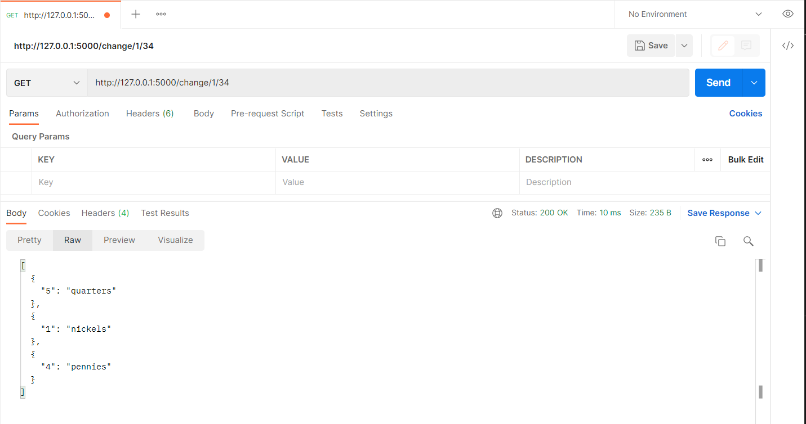
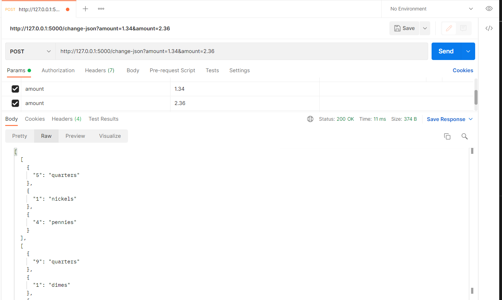
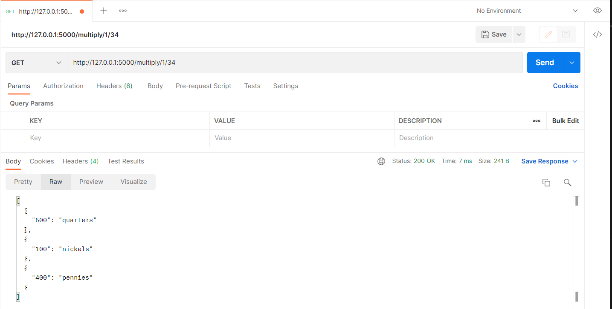

[](https://github.com/louis-mouline/flask-change-microservice/actions/workflows/main.yml)

# flask-change-microservice

Small Flask Microservice that makes change. It is a project part of the second class of the Specialization [Building Cloud Computing Solutions at Scale](https://www.coursera.org/specializations/building-cloud-computing-solutions-at-scale)

## Invoke Endpoint

* Create virtualenv and source it: `python3 -m venv ~/.fcm && source ~/.fcm/bin/activate`;
* Install and Test:  `make all`;
* Run it:  `python app.py`;
* Invoke it using Postman.

Three methods are available:
1. **Change** (GET method): Provides the change based on the amount the person has;
```localhost:5000/change/<dollar>/<cents>```
2. **Change** (POST method): Provides the change for one or several different amounts;
```localhost:5000/change-json?amount=<amount>&amount=<amount2>```
3. **Multiply** (GET method): Multiply the amount of the change by a 100.
```localhost:5000/multiply/<dollar>/<cents>```

### Postman

Here you can find the results of each request using Postman.

#### Change (GET method)



#### Change (POST method)



#### Multiply (GET method)




